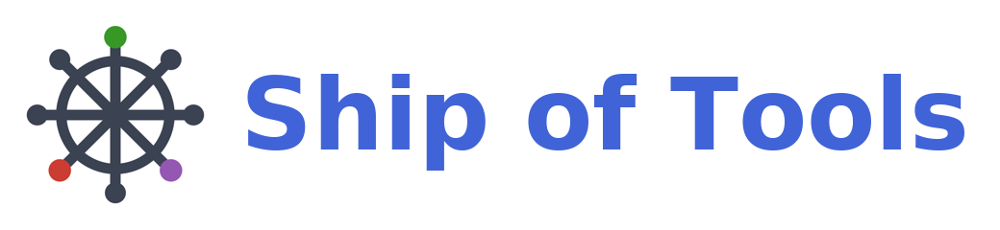

<p align="center">
  <picture>
    <source media="(prefers-color-scheme: dark)" srcset="logo-wordmark-dark.png">
    
  </picture>
</p>

[](https://kalidke.github.io/ship-of-tools/stable/)
[](https://kalidke.github.io/ship-of-tools/dev/)
[](https://github.com/kalidke/ship-of-tools/actions/workflows/CI.yml?query=branch%3Amain)
[](https://codecov.io/gh/kalidke/ship-of-tools)

> **An opinionated, agentic development system for the Julia language.**
> Drive Claude Code agents from the keyboard — they write and run the code; you
> steer, watch, and review.

<p align="center">
  <a href="docs/src/assets/screenshots/hero.png">
    
  </a>
</p>
<p align="center"><sub>A real working session (5120×2160) — nav · preview · agent · inline REPL figure · state-colored session strip. Click for full size.</sub></p>

**📖 [Documentation](https://kalidke.github.io/ship-of-tools/dev/)** ·
[What it can do](https://kalidke.github.io/ship-of-tools/dev/features/) ·
[Roadmap](docs/plan.md)

## Drive agents, don't type code

Ship of Tools turns Julia development into **directing Claude Code agents** — you
steer, watch, and review; they write and run the code. It is **opinionated**: the
layout is designed, not configured.

## What you can do

- **Run multiple Claude Code agents** — see each one's status via a color scheme, and switch fast between their repos and conversations.
- **Agents coordinate** — sessions message each other and spawn sessions for worktrees and other repos.
- **Agents drive the UI** — skills and hooks let Claude Code open images and files in your nav pane.
- **Ask the agent for help** — the in-app Claude Code session doubles as a help system, answering how-to questions about Ship of Tools from its in-repo docs.
- **Copy to the LLM** — send paths, images, and image crop/zooms straight to the agent.
- **Remote-first** — backend on a remote server, frontend on your machine.
- **Multiple frontends, one backend** — connect laptop and desktop to the same backend at once.
- **Sessions persist** — the backend runs in tmux; close the lid and reopen without losing state.
- **Keyboard-driven** — navigate, switch panes and modes, and act entirely from the keyboard.
- **Remappable keybindings** — remap the configurable action chords per-repo (`.sot/keybindings.toml`) or per-user; unlisted actions fall through to the defaults.
- **Full-screen any pane.**
- **Live Julia** — dispatch code to a fresh or existing REPL; plots render inline.
- **Pluto notebooks** — open notebooks running on the remote.
- **Extensible previews** — add a file type with Julia multiple dispatch, no Rust.
- **Rich previews** — Markdown, Quarto, PDF, PNG, LaTeX math, and video (poster frame in-pane; playback opens in your browser).
- **Pan and zoom figures** — same-size figures in a directory share pan/zoom.
- **Web pages locally** — serve a static page to your browser over an auto-forwarded port with one key chord.
- **Host monitoring** — CPU, RAM, and GPU across servers, plus a built-in terminal.

**Envisioned**

- Slack integration
- Overleaf integration
- Collaborative features
- Codex-driven agent sessions that interact with your Claude agents (in beta)
- More preview types
- A repo concept / math explorer
- Better macOS support — Cmd-based keybindings (in place of Ctrl) and macOS docs

See the full tour: **[What Ship of Tools Can Do](https://kalidke.github.io/ship-of-tools/dev/features/)**.

## Install

**Tell your agent (recommended).** Ship of Tools installs the way it works:
start a Claude Code (or other) coding-agent session on the target machine
and say:

```text
Install Ship of Tools: fetch https://raw.githubusercontent.com/kalidke/ship-of-tools/main/docs/INSTALL-AGENT.md and follow it.
```

The agent runs preflight, asks you one topology question, drives the
installer, and proves the result answers before it says done.

**Prebuilt (script).** Current version: `0.2.3`. Every
[release](https://github.com/kalidke/ship-of-tools/releases) ships prebuilt
Linux and Windows binaries. macOS frontend and backend support is untested.
The installer also clones this repo at the release tag (a small blobless
checkout at `$PREFIX/repo/current` — it is the product's resource tree *and*
its manual: the in-app agent reads it, via `$SOT_MANUAL`, to answer help
questions). Runtime resources resolve through `resource_dir` to the checkout
(ADR 0030 amendment 2026-07-04; the curated Julia bundle is retired).

On Linux, `scripts/install.sh` downloads the latest release by default,
verifies SHA256 checksums, lays out `~/.local/share/sot`, installs Julia via
juliaup when a backend role needs it, writes config under `~/.config/sot`, and
wires the launcher and backend service. With no role flag and an interactive
TTY, it opens a role Q&A; without a TTY, pass a role flag explicitly:

```bash
bash scripts/install.sh                       # interactive role Q&A (TTY required)
bash scripts/install.sh --local               # frontend + backend on this machine
bash scripts/install.sh --backend <host>      # frontend here, backend on <host> over SSH
bash scripts/install.sh --be-only             # headless backend only
bash scripts/install.sh --be-only --no-service # shared-$HOME box; skip systemd user unit
```

Requirements: Linux x86_64; frontend roles require glibc ≥ 2.35, while
`--be-only` skips the frontend floor because the backend binary is static.
Remote layouts require key-based SSH to the backend host. **Re-running the
installer is also the updater** — one command moves binaries, the repo
checkout, and Julia envs together; installed instances additionally notify
you of new releases and stage fresh binaries themselves. Changing roles backs
up and rewrites `hosts.toml`. Details:
**[Install](https://kalidke.github.io/ship-of-tools/dev/start/install/)**.

**From source (contributors / dev fleet).**

```bash
git clone https://github.com/kalidke/ship-of-tools
cd ship-of-tools
cargo build --release --manifest-path rust/Cargo.toml   # frontend + backend
julia --project=. -e 'using Pkg; Pkg.instantiate()'     # umbrella env
julia --project=core -e 'using Pkg; Pkg.instantiate()'
julia --project=julia/kernel -e 'using Pkg; Pkg.instantiate()'
julia --project=julia/repl -e 'using Pkg; Pkg.instantiate()'
```

Source builds are version-stamped `-dev` and never self-update. For
authoritative, OS-specific setup (Rust via rustup, Julia via juliaup, config
files, a launcher, and the statusline) see
**[Per-Machine Setup](https://kalidke.github.io/ship-of-tools/dev/start/setup/)**.

## Quick start

Launch the frontend; it connects to (or spawns) a backend and a Julia kernel.
Switch modes with `f` (Files) / `m` (Modules), navigate with the arrow keys,
toggle the REPL drawer with `Ctrl+J` and the Terminal with `Ctrl+T`, and press
`?` for the full keymap. See the
[Guided Tour](https://kalidke.github.io/ship-of-tools/dev/start/tour/).

## How it works

Three processes plus your REPL, talking over a socket: a **Rust frontend**
(native window, rendering), a **Rust backend daemon** (project state, file
watching, agent sessions), and a **Julia kernel** (Julia-aware introspection and
previews). The socket boundary is why the backend can live on a remote server
while the frontend runs on your laptop. Details:
[Architecture](https://kalidke.github.io/ship-of-tools/dev/guide/architecture/).

## Extending

Teach Ship of Tools a new file type without touching Rust:

```julia
module PngPreview
using ConceptExplorerCore
struct PngFile <: FileType end
ConceptExplorerCore.matches(::Type{PngFile}, path) = endswith(lowercase(path), ".png")
ConceptExplorerCore.preview(::Type{PngFile}, path) = PreviewPayload("image/png", read(path))
end
```

See **[The Dispatch ABI](https://kalidke.github.io/ship-of-tools/dev/extend/abi/)**
and the [HDF5 worked example](https://kalidke.github.io/ship-of-tools/dev/extend/hdf5/).

## Contributing

Design decisions live in [`docs/adr/`](docs/adr/); scope lives in
[`requirements.md`](requirements.md); the phase plan lives in
[`docs/plan.md`](docs/plan.md). See the
[Contributing guide](https://kalidke.github.io/ship-of-tools/dev/contributing/)
before opening a PR.

## License

See [LICENSE](LICENSE).
