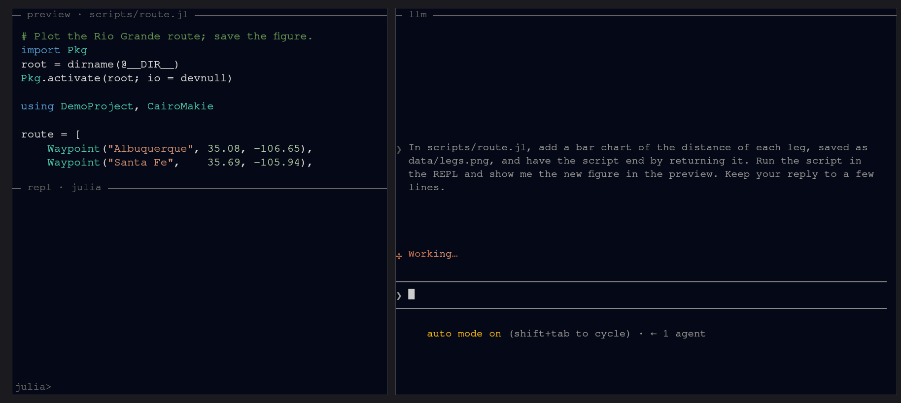
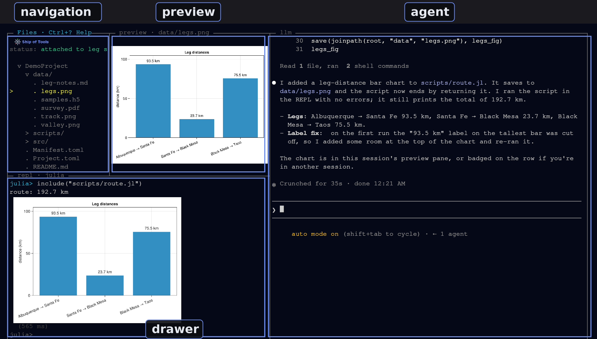
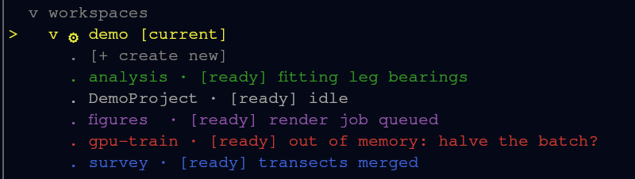

<p align="center">
  <picture>
    <source media="(prefers-color-scheme: dark)" srcset="logo-wordmark-dark.png">
    
  </picture>
</p>

[](https://github.com/kalidke/ship-of-tools/releases)
[](https://kalidke.github.io/ship-of-tools/dev/)
[](https://github.com/kalidke/ship-of-tools/actions/workflows/CI.yml?query=branch%3Amain)

Pre-1.0: interfaces still change between releases.

Ship of Tools is an agentic development environment for Julia: you and a Claude Code session share one Julia REPL, in a desktop window that also shows your figures and files; Codex sessions run alongside without it for now. Linux; Windows and macOS run as frontends to a Linux backend (macOS is experimental). See [Platforms](https://kalidke.github.io/ship-of-tools/dev/start/install#platforms).

<p align="center">
  <a href="https://kalidke.github.io/ship-of-tools/dev/">
    
  </a>
</p>
<p align="center"><sub>A Claude Code session edits the script, runs it in the shared Julia REPL, and shows the new chart (navigation column cropped). <a href="https://kalidke.github.io/ship-of-tools/dev/">Documentation</a></sub></p>

<p align="center">
  
</p>
<p align="center"><sub>The default layout with the Julia drawer open.</sub></p>

The window is GPU-rendered, with a keyboard-driven, terminal-style layout: a navigation tree, a file preview, an agent pane and a Julia REPL drawer. The agents write code and run it in the persistent REPL while you watch and review the results.

Compared with Claude Code next to a REPL in tmux, or with VS Code, its Julia extension and a Claude Code panel:
- The agent and you share one REPL.
- Figures, PDFs and typeset math render in one keyboard-driven window.
- The backend and its sessions keep running on the server when the window closes.

## What it does

**Agents**
- Each session is a row running Claude Code, Codex or a plain shell, coloured by its [work state](https://kalidke.github.io/ship-of-tools/dev/concepts/work-state) so you can see which one needs you.
- Claude Code sessions run Julia in the session's persistent REPL, and each run appears in your REPL drawer.
- Sessions message each other over a built-in relay and can start sessions for worktrees and other repos.
- An agent can open a file or figure in your preview pane to show you what it produced, and you can hand it a file path or a cropped region of an image.
- There is no diff view of its own: you review the agent's edits in the preview pane, which follows a file as it changes on disk, in the REPL drawer, which shows every run the agent made, and with `git` in a shell session. To change a file yourself, focus the preview and press `e` for the built-in editor; `Ctrl+S` saves.

**Julia live loop**
- A persistent REPL per session. `r` on a `.jl` file runs it in a fresh REPL, restarting the session's REPL and dropping whatever the agent had built in `Main`; `Shift+R` includes it in the current one. The drawer is Ship of Tools' own input line, with pkg mode (`]`) and history, but no `?` help, `;` shell or Tab completion. See [Dispatching code](https://kalidke.github.io/ship-of-tools/dev/guide/repl#Dispatching-code).
- CairoMakie figures render in the window. `wglshow(fig)` opens an interactive WGLMakie figure in your browser; Pluto notebooks run on the backend host.

**Previews**
- The preview pane renders the file under the cursor: markdown with typeset math, paged PDF, images, HDF5 structure, syntax-highlighted Julia, a video poster frame.
- Same-size images in a directory share pan and zoom, so stepping through a run's plots keeps the framing.
- Modules mode lists a package's modules and their definitions: types, functions, macros and submodules.

**Machines**
- The backend runs where the data and GPUs are; the window runs on your laptop and attaches over SSH.
- Several frontends can attach to one backend at the same time.
- With a remote backend, sessions keep running when the laptop lid closes, and sessions, REPLs and agents survive a frontend restart. A monitor drawer shows CPU, memory and GPU across your Linux hosts.

**Extend**
- Add a preview for a new file type in Julia, with no Rust changes. The built-in text, source, PDF and video previews use the same interface.

See the [feature gallery](https://kalidke.github.io/ship-of-tools/dev/features) for a short recording of each one.

<p align="center"></p>
<p align="center"><sub>Demo session rows tinted by work state: green working, red waiting for your answer, purple waiting on a job, blue done, gray idle.</sub></p>

## Install

Install frontend and backend on one Linux machine yourself:

```bash
curl -fsSL https://raw.githubusercontent.com/kalidke/ship-of-tools/main/scripts/install.sh | bash -s -- --local
```

Or start a coding-agent session (Claude Code or Codex) on the target machine and say:

```text
Install Ship of Tools: fetch https://raw.githubusercontent.com/kalidke/ship-of-tools/main/docs/INSTALL-AGENT.md and follow it.
```

Use `--backend <ssh-alias>` for a frontend here with the backend on a remote host, or `--be-only` for a headless backend.

Needs on every machine:
- **git, curl and tar.**
- **Julia 1.12 or newer**, on every role, not only the backend (installed with juliaup if missing; an existing juliaup only gets the 1.12 channel added, so run `juliaup default 1.12` yourself if your default channel is older, or set `SOT_JULIA_BIN`).
- **Claude Code or Codex**, installed and logged in.
- **Frontend only:** Linux with glibc 2.35 or newer and a desktop session with a Vulkan driver (a `--be-only` backend is a static binary with no glibc floor).
- **A home directory on NFS** (or another remote filesystem) needs a systemd drop-in pointing the daemon's state root at local disk before sessions will start; see [A session will not start on a shared home](https://kalidke.github.io/ship-of-tools/dev/guide/troubleshooting#A-session-will-not-start-on-a-shared-home).

Optional on the backend machine: node/npm for typeset math, poppler-utils for PDF previews and ffmpeg for video poster frames.

What it touches:
- Everything goes under your home directory, mostly `~/.local/share/sot`, plus user lingering (`loginctl enable-linger`) so the user-level `sotd` systemd service keeps the backend running after logout on Linux.
- Skills and hooks go into your global `~/.claude` and `~/.codex`, where your own sessions see them; the hooks do nothing in a session that has not joined the Ship of Tools session registry. Hooks are merged into `~/.claude/settings.json` without removing existing ones; a skill of yours with the same name as a shipped one is overwritten without a backup; the generic names are `julia-repl`, `show-result`, `sitrep`, `worktree` and `project-log`.
- Sessions start their agent with fixed permission flags: Claude Code in auto mode; Codex with approvals, the sandbox and hook trust all bypassed (`--dangerously-bypass-approvals-and-sandbox --dangerously-bypass-hook-trust`). What each setting means is in [How agent sessions are launched](https://kalidke.github.io/ship-of-tools/dev/start/install#How-agent-sessions-are-launched).
- There is no uninstall script; removal is manual, with the commands in [Uninstall](https://kalidke.github.io/ship-of-tools/dev/start/install#install-uninstall).

No isolated mode yet: try it under a separate user account or in a VM. See [What the installer changes](https://kalidke.github.io/ship-of-tools/dev/start/install#install-footprint).

The full list, Windows, source builds and updating are in [Install details](https://kalidke.github.io/ship-of-tools/dev/start/install).

## First session

Run `sot-launch` (or the desktop entry). Then:

| Key | What happens |
|---|---|
| `s`, then `[+ create new]` | Start a session in a project directory ([Quickstart](https://kalidke.github.io/ship-of-tools/dev/start/quickstart)) |
| `f` / `m` | Files mode / Modules mode in the navigation pane; the preview follows the cursor |
| `Ctrl+J` | Show or hide the Julia REPL |
| `Ctrl+?` / `F1` | The focused pane's actions / the searchable Help drawer |

The full walkthrough is [Your first session](https://kalidke.github.io/ship-of-tools/dev/start/tour); every key is in [Keybindings](https://kalidke.github.io/ship-of-tools/dev/ref/keybindings).

## Extend

A preview for a new file type is a small Julia package: a `FileType` subtype, a `matches` method and a `preview` method, with no Rust changes. A third-party plugin currently loads only from a source checkout, not from a release install; see [Discovery](https://kalidke.github.io/ship-of-tools/dev/extend/discovery).
The [documentation home](https://kalidke.github.io/ship-of-tools/dev/) has a short CSV example, and the [HDF5 preview tutorial](https://kalidke.github.io/ship-of-tools/dev/extend/hdf5) walks through a full one.

## Status

In active development. Linux; Windows and macOS run as frontends to a Linux backend (macOS is experimental). See [Platforms](https://kalidke.github.io/ship-of-tools/dev/start/install#platforms).

## Contributing

Read the [contributing guide](https://kalidke.github.io/ship-of-tools/dev/contributing) before opening a PR; design decisions are in [`docs/adr/`](docs/adr/).

## License

Dual-licensed: [AGPL-3.0-or-later](LICENSE), with a commercial license available for products and services that cannot meet the AGPL's source-sharing terms. Details in [LICENSING.md](LICENSING.md).
