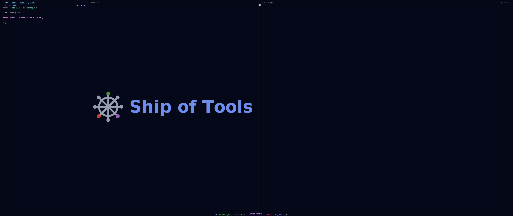

# Color Coding

Color coding is a cross-cutting layer. The same entity carries the same
provenance no matter which mode you view it in, so Ship of Tools renders that provenance
**uniformly across all modes** — a stale annotation looks stale in Modules mode,
Files mode, and every other mode, because staleness belongs to the entity, not
to the view.

Color and badging are orthogonal to mode. A mode decides *what tree to show*;
the color layer decides *how each node is tinted* based on who touched it, when,
and whether its annotation still matches the code.

!!! note "Design vs. built today"
    This page describes the cross-cutting colour layer as designed. What renders today is the per-session **agent work-state** colour (idle · working · blocked · waiting · done, on the Sessions strip and nav rows) and the **stale-annotation** drift badge. The per-entity provenance states in the table below — user-edited, agent-edited accept/reject, immutable/external, pinned/favorited — are planned.

*The per-session work-state colors: working, idle, blocked, waiting, done — one session mid-flash on a state change.*

## The states

| State | Appearance | Meaning |
|-------|------------|---------|
| User-edited recently | Warm color, fades over time | You touched this entity lately; the warmth decays as it ages. |
| Agent-edited, unaccepted | Distinct color (unresolved diff) | An agent changed this and you have not yet accepted or discarded the change. |
| Agent-edited, accepted | Neutral, small sigil | An agent's change that you accepted; marked with a small sigil but otherwise neutral. |
| Immutable / external | Dimmed | Base, dependencies, vendored code — not yours to edit, rendered dimmed. |
| Stale annotation | Yellowed | The entity's [concept annotation](concept-layer.md) was written against older code (AST hash mismatch). |
| Pinned / favorited | Accented border | You marked this entity for quick return; rendered with an accented border. |

## Why it is mode-independent

Provenance is a fact about an entity: who edited it, when, whether its annotation
is current. None of those facts change when you switch the root tree from Files
to Modules. Encoding them once, at the entity level, means you do not relearn a
color scheme per mode — a yellowed badge always means "the prose may not match
the code," wherever you see it.

The "stale annotation" state is the direct rendering of the staleness detection
described in [The Concept Layer](concept-layer.md): when an annotation's
`synced_against` hash no longer matches its target's current AST hash, the entity
yellows in every mode until you refresh it.
