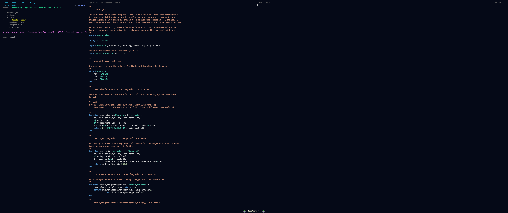

# The Concept Layer

The concept layer is what makes Ship of Tools a *concept explorer* rather than a file
browser. It is prose — intent, contracts, meaning, math — attached to the units
of a Julia project and kept honest against the code those units describe. The
LLM is the primary author and maintainer of this layer; the user can edit it
too.


*A stale annotation: its `synced_against` hash no longer matches the code, so the drift badge renders until someone refreshes the prose.*

It is built from two layers with very different update mechanics. Keep them
separate in your head:

| Layer | Source | Currency | LLM involved? |
|-------|--------|----------|---------------|
| **Structural** | parsed mechanically from code via `JuliaSyntax.jl` (plus live introspection where the project is loaded) | always current | no |
| **Annotation** | LLM- or user-authored prose attached to nodes in the structural layer | can drift | yes |

The structural layer is derived, never stored as a fact you can get wrong — it
is recomputed from the source. The annotation layer is the part that can fall
out of sync, so the whole design below is about *detecting and surfacing that
drift* rather than trying to prevent it.

## The `.concept/` sidecar

Annotations live in a sidecar `.concept/` directory at the project root, mirroring
the conceptual structure of the project:

```text
.concept/
  project/intent.md
  modules/MyModule.md
  types/MyModule/MyType.md
  functions/MyModule/myfunction.md
  math/geometry/rotation.md
```

The directory is plain files on disk. That is deliberate: it survives a restart,
diffs cleanly in git, and is readable without Ship of Tools running. Each path
corresponds to a node you can navigate to in a mode — a module in Modules mode,
a type in Types mode, a derivation in Math mode — so the annotation for a node
is always at a predictable location.

## Frontmatter

Each annotation file carries YAML frontmatter that ties the prose to the entity
it describes and records when it was last reconciled:

```yaml
target: MyModule.MyType
target_kind: type
synced_against: <ast_hash>
synced_at: 2026-01-15T14:30Z
authored_by: orchestrator | user
references:
  - MyModule.method1
  - math/geometry/rotation
```

| Field | Meaning |
|-------|---------|
| `target` | the entity this annotation describes |
| `target_kind` | what kind of entity (`type`, `function`, `module`, …) |
| `synced_against` | the AST hash of `target` at the last reconciliation |
| `synced_at` | timestamp of that reconciliation |
| `authored_by` | `orchestrator` or `user` — provenance feeds [Color Coding](color-coding.md) |
| `references` | links to other entities or annotations (verification is planned — see below) |

The load-bearing field is `synced_against`. It is the AST hash of the target as
of the last time the annotation was confirmed accurate. Staleness is just a
comparison: recompute the target's hash now, and if it differs from
`synced_against`, the prose was written against an older version of the code.
Today `synced_against` is the only field the backend parses; the rest of the
frontmatter is preserved verbatim across edits and shown above the editor, but is
not otherwise acted on.

## The AST hash

The hash is computed from the parsed AST of the targeted entity, not its raw
text, so it ignores changes that don't matter and catches changes that do:

- Reformatting and whitespace **outside** string literals → same hash. Running a
  formatter does not mark anything stale.
- Whitespace **inside** docstrings or string literals → different hash. A
  meaningful docstring edit is a meaningful change.
- Variable renames → different hash.

The algorithm walks the `JuliaSyntax.SyntaxNode` tree depth-first — `SyntaxNode`
already excludes trivia (whitespace and comments) — emitting each node's `kind`
and, for leaf nodes, the node's source text. That byte stream is hashed with
SHA-256 and rendered as the full 64-character hex digest (no truncation, no
version prefix).

## Update lifecycle

Drift detection is reactive — Ship of Tools surfaces it, you fix it when you choose to:

1. **You save a file.** (Either you edited it, or the orchestrator did.)
2. **The kernel re-parses the affected files** and recomputes AST hashes for the
   entities in them.
3. **Annotations whose target's hash changed are marked stale.** The comparison
   is `current_hash != synced_against`.
4. **Stale annotations render with a yellowed / wilting badge** — and they render
   that way in *every* mode, because staleness is a property of the entity's
   provenance, not of any one view. See [Color Coding](color-coding.md).

There is no background sweep in phase 1. Nothing recomputes annotations on a
timer or refreshes them behind your back. Visible drift is the feature: a
yellowed badge tells you the prose may no longer match the code.

## Reactive refresh

The intended model is reactive: navigate to the stale annotation and trigger a
refresh with a single keypress that re-stamps `synced_against` (and `synced_at`)
to the target's current hash, marking the prose as reconciled against the present
code. You stay in control of *when* — a refresh asserts the annotation is still
accurate, so it is a deliberate act, not an automatic one.

That one-key re-stamp is not yet built. Today you reconcile a stale annotation by
editing it in place (`e`), updating its `synced_against` in the frontmatter, and
saving (`Ctrl+S`); `Esc` discards. A background staleness sweep is also
explicitly deferred; refresh is on-demand only.

## Reference verification (planned)

The `references` list links an annotation to other entities (`MyModule.method1`)
or to other annotations (`math/geometry/rotation`). A background pass that
verifies these links after every re-index is planned: when a referenced entity no
longer exists — a method was deleted, a derivation renamed — the link would be
broken, and the annotation marked stale on that basis too, keeping the concept
layer internally consistent, not just consistent with code. Today the
`references` field is preserved on disk but not verified.

## See also

- [Color Coding](color-coding.md) — how staleness and authorship render across modes.
