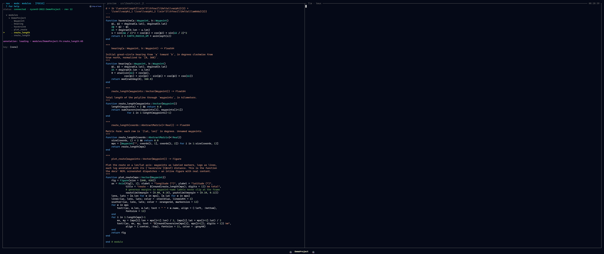

# Modes

A **mode** is a switchable root for the navigation tree. Every mode has the same
shape — a parent → current → children hierarchy shown as a collapsible outline —
and a hotkey swaps which tree fills it. **Cursor position is preserved per mode**
across switches, so jumping from Files to Modules and back lands you exactly where
you left each one.

*Modules mode over the demo project: module → definitions → methods of a two-method function.*

Modes are a **planned** plugin surface: the design is a [`Mode`](@ref) subtype
with `tree_root` / `tree_children` / `preview_for` methods adding a new root, and
the core modes shipping as methods on that same type with no privileged path.
Today the nav roots are fixed in the frontend (Files, Modules, Sessions, Hosts)
and the kernel hosts the modes directly; the mode-plugin seam is not yet wired.
See [The Dispatch ABI](../extend/abi.md) and [Writing a Mode Plugin](../extend/mode.md).

## The same shape everywhere

The window's navigation pane is a single collapsible tree: a parent context, the
current level, and its children, shown through nesting. What changes between modes
is *what* the tree enumerates and what the preview pane shows for the cursored node.

| Mode | Level 1 → Level 2 → Level 3 | Preview |
|------|-----------------------|---------|
| Project | Sections → contents → subitems | Rendered markdown / task detail |
| Files | Parent dir → current dir → contents | File at appropriate fidelity |
| Modules | Modules → functions → methods | Method source + concept artifact |
| Types | Types → facets (fields/methods/sub) → members | Type def + meaning + data shape |
| Math | Concept areas → concepts → derivations/impls | LaTeX + implementing functions |
| Outputs | Recent runs → contents → artifacts | PNG / plot / JSON / MP4 |
| Agents | Tasks → timeline → step detail | Diff / live tail / message |

This table is the **conceptual mode set** — the design target. Not all of it is
built yet; see the status breakdown below.

## Built today vs planned

| Mode | Status |
|------|--------|
| Files | **Built.** Filesystem navigation with previews. |
| Modules | **Built, read-only.** Structural view derived from `JuliaSyntax.jl`. |
| Types | Planned (after phase 1). |
| Math | Planned (after phase 1). |
| Outputs | Planned (after phase 1). |
| Agents | **Partly here.** Multi-agent is real *today* — concurrent Claude Code sessions coordinated over the comm bus and surfaced in the Sessions view. What is pinned for later is *this dedicated mode*: an in-UI tasks → timeline → step-detail view for orchestrating them. |

The conceptual set above describes where modes are going. What you can switch
between *today* is the set of operational nav modes bound in the keymap, below.

## The nav modes bound today

The frontend binds four navigation modes. Each is a single-character chord that is
active **only in navigation focus** — in the pty panes, the editor, or a prompt,
those characters stay literal text.

| Key | Mode | What it roots the tree at |
|-----|------|---------------------------|
| `f` | Files | the project filesystem |
| `m` | Modules | modules → functions → methods (read-only, from `JuliaSyntax.jl`) |
| `s` | Sessions | workspaces — the projects this backend is hosting |
| `h` | Hosts | the remote hosts you can target |

Files and Modules are the two conceptual modes wired up so far. Sessions and Hosts
are **operational** modes — they navigate the deployment surface (which project,
which machine) rather than the concept hierarchy of a single project.

### Sessions mode (`s`)

Sessions mode lists the workspaces the backend knows about and lets you commit a
new one. The session picker uses two chords on the cursored directory:

| Chord | Action |
|-------|--------|
| `Enter` | Create a workspace and start the comm-aware orchestrator agent in it. |
| `Shift+Enter` | Create a **bare** workspace — no LLM agent, just a plain shell / REPL. |

One backend daemon hosts one Julia kernel per workspace, routed by `workspace_id`,
so switching workspaces is fast and does not tear down the kernel — switching is
"like tmux windows in the same session." You can also cycle the active workspace
directly with `Shift+ArrowRight` / `Shift+ArrowLeft`.

### Hosts mode (`h`)

Hosts mode picks which remote the frontend targets. The choice is persisted, and
every mechanism that re-opens the connection — launcher startup, the tunnel
supervisor after a wake or wifi flap, and frontend transport reconnect — routes to
the *same* persisted host rather than silently bouncing to a different one. There
is no live in-session host swap by design; switching hosts is "pick a host, quit,
relaunch," because a new host means cold-starting that host's daemon state.

## Switching, focus, and layout keys

Mode switches share the keymap with pane focus and layout. The relevant chords:

| Chord | Action |
|-------|--------|
| `f` / `m` / `s` / `h` | switch nav mode (nav focus only) |
| `Shift+ArrowLeft` / `Shift+ArrowRight` | cycle the active workspace |
| `Ctrl+ArrowLeft/Right/Up/Down` | move pane focus (4-way, spatial) |
| `Alt+=` | maximize the focused pane; `Escape` restores |
| `Ctrl+j` / `Ctrl+t` / `Ctrl+m` | toggle the REPL / Terminal / Monitor drawers |
| `?` | toggle the help overlay |

Because the mode keys are plain single characters, they are deliberately scoped to
navigation focus — the keymap matches them only when a nav pane is focused, so
typing `f` into the REPL or the editor inserts an `f`. The authoritative chord list
lives in [Keybindings](../ref/keybindings.md).
