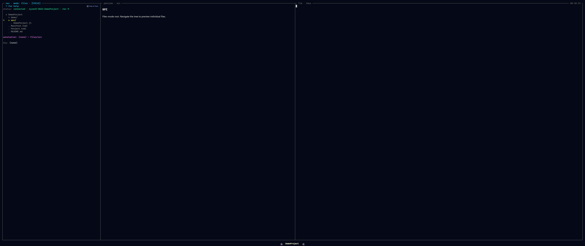
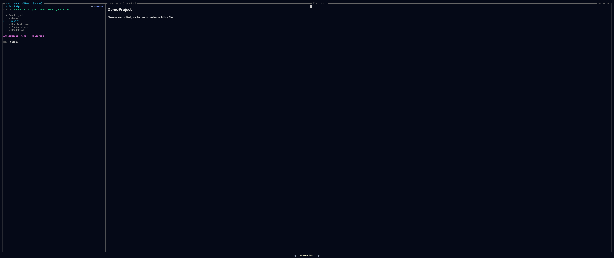

# The Navigation Pane

*Top-left.* The navigation pane is the **mode tree** — a single collapsible
outline (a parent context, the current level, and its children, shown through
indentation and disclosure carets) that you walk with the arrow keys. It is the
pane you steer from; the [Preview pane](preview.md) reflects whatever node the
cursor is on.

*Files mode mid-descent: parent directory, current directory, and children.*

## What fills it

A **mode** is a switchable root for this tree. A hotkey swaps which tree fills the
columns, and **cursor position is preserved per mode**, so jumping between modes
and back lands you where you left each one. The modes bound today:

| Key | Mode | Roots the tree at |
|-----|------|-------------------|
| `f` | Files | the project filesystem |
| `m` | Modules | modules → functions → methods (read-only, from `JuliaSyntax.jl`) |
| `s` | Sessions | the workspaces this backend is hosting |
| `h` | Hosts | the remote hosts you can target |

The mode keys are plain single characters, so they are **scoped to navigation
focus**: typing `f` into the REPL or a prompt inserts an `f`, it does not switch
modes. The full conceptual mode set (Project, Types, Math, Outputs, Agents) and
what is built today is on the [Modes](../modes.md) page.

## Driving it

| Action | Key |
|--------|-----|
| Move up/down the tree | `↑` / `↓` |
| Descend into the cursored node | `→` |
| Back up a level | `←` |
| Switch nav mode | `f` / `m` / `s` / `h` |
| Focus this pane from elsewhere | `Ctrl+Arrow` (spatial) |
| Copy the cursored file's path to the clipboard | `c` |

Modes are a **planned plugin surface**: the design is a `Mode` subtype with
`tree_root` / `tree_children` / `preview_for` methods — the core modes shipping
the same way, with no privileged path. Today the nav roots are fixed (the four
above) and kernel-hosted; the mode-plugin seam is not yet wired. See
[Writing a Mode Plugin](../../extend/mode.md) and
[The Dispatch ABI](../../extend/abi.md).

*A pinned row: the sigil marks it in the tree and the preview title carries the `[pinned]` chrome.*

## See also

- [Modes](../modes.md) — every mode, its column shape, and built-vs-planned status.
- [Color Coding](../color-coding.md) — the cross-cutting provenance colours every tree carries.
- [Previews](../previews.md) — what the [Preview pane](preview.md) shows for the cursored node.
