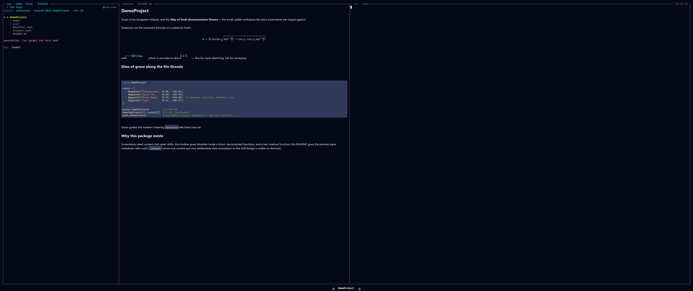

# The Preview Pane

*Top-right.* The preview pane renders whatever the [Navigation pane](navigation.md)
cursor is on, at the fidelity appropriate to its type — markdown rendered, PNGs
shown, `.jl` syntax-highlighted, PDFs paged, video as a poster frame. Nothing is
reduced to plain text.

*A markdown file with LaTeX blocks — math is typeset (MathJax → SVG), not shown as source.*

## What fills it

Every preview travels one dispatch path: a `FileType` plugin claims the path with
`matches` and returns a `PreviewPayload` from `preview`. The payload's `mime`
tells the frontend which renderer to use; the bytes are opaque to Rust, so adding
a format is a **Julia-only** change. A sampling of the built-ins:

| Kind | Rendered as |
|------|-------------|
| `.jl` | syntax-highlighted source (tokenized kernel-side, no client re-parsing) |
| `.md` | rendered markdown, including inline math |
| `.json` / `.toml` / `.txt` | plain text (JSON/TOML pretty-print / colour planned) |
| `.pdf` | one rasterized page; `n` / `p` turn pages |
| video (`.mp4`, `.webm`, …) | a poster frame; `o` opens playback in the browser |

The full table — every built-in type and its MIME — is on the
[Previews](../previews.md) page.

## Beyond static rendering

- **Opens in the browser, not the pane.** Interactive HTML, Pluto notebooks, and
  Quarto documents pop out to the OS browser over a forwarded port rather than
  rendering in-pane; the source still previews as text. Same policy as video.
- **Capture a region for the LLM.** On a raster image you can crop a zoomed region
  and hand it straight to the orchestrator — "what's the artifact here?". The crop
  is taken from the source image on the backend, so the agent sees exactly what
  you do.
- **No silent blanks.** When an external tool is missing (ffmpeg, poppler), the
  plugin returns a `text/markdown` note explaining the gap instead of an empty
  pane.

## See also

- [Previews](../previews.md) — the full built-in file-type table and the browser pop-out policy.
- [Writing a FileType Plugin](../../extend/filetype.md) and [The Dispatch ABI](../../extend/abi.md) — teach the pane a new format with no Rust change.
- [The REPL](../repl.md) — figures from the REPL render through this same preview layer.
