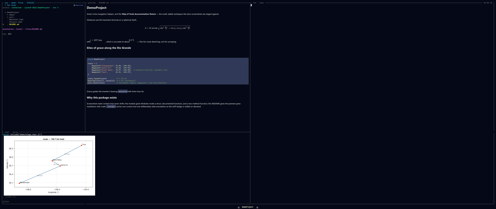

# The REPL Pane

*Bottom-right drawer — `Ctrl+J`.* The REPL pane is a **persistent Julia session**
available throughout a session: the same bindings, the same loaded packages — but
its output is structured, and the figures it produces render **inline in the
native window** rather than as terminal text. It shares the bottom drawer slot
with the [Terminal](terminal.md) and [Monitor](monitor.md).

This page covers the pane itself — what fills it, its keys, how to drive it.
For the frame schema, dispatch semantics, and figure-rendering mechanics in
depth, see [The REPL](../repl.md).

*The REPL pane: structured output with a CairoMakie figure rendered inline.*

## What fills it

A Julia process **supervised by the backend daemon**, distinct from the kernel
that does project introspection. They are separate on purpose: the kernel owns
dispatch tables, mode trees, indexing, and AST hashing; the REPL owns your
interactive state. Because they are different processes, **killing the REPL does
not kill the kernel** — you can restart your interactive session to clear state or
recover from a wedged computation without losing the project view.

## Driving it

Two ways to drive it, without retyping:

- **Run a `.jl` file** from Files mode — `R` `include`s it into the current
  session; `r` first resets the REPL into the file's own project, then runs it.
- **Type at the prompt** — `Enter` submits, `Shift+Enter` inserts a newline.

Per-line and per-block dispatch (the line at the cursor, or the surrounding
top-level form) are **planned**, not yet built.

A long-running evaluation runs on its own task, so it does not block the dispatch
loop and you can interrupt it mid-eval — a real `InterruptException`, the same as
`Ctrl-C` in the stock REPL.

## Structured output

Instead of one undifferentiated text stream, the display shim emits **typed
frames** — `stdout`, `stderr`, `value`, `image`, `error`, and a terminal `done` —
so the frontend renders each correctly: `stdout`/`stderr` stream as bytes arrive,
errors carry a structured stacktrace with `file:line` links, and a showable value
(a CairoMakie `Figure`, a `Plots.Plot`, anything with `show(io, MIME"image/png")`)
becomes an `image` frame **drawn inline through the preview layer** — never a
degraded terminal-graphics protocol.

## See also

- [The REPL](../repl.md) — the frame schema, dispatch semantics, and figure rendering in depth.
- [The Orchestrator](orchestrator.md) — the agent dispatches code to this same REPL via a tool.
