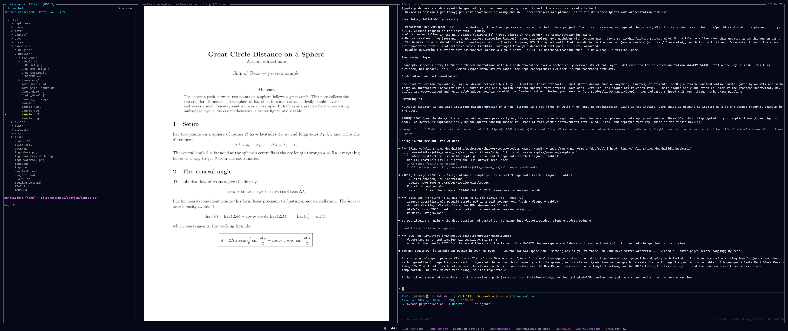
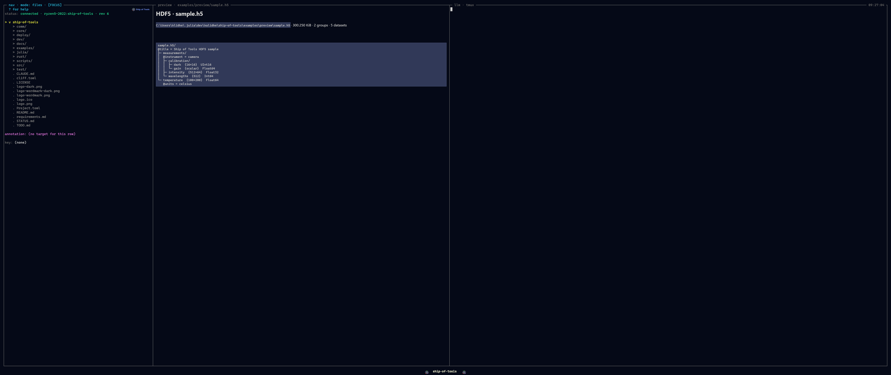

# Previews

When you cursor a file in any mode, the preview pane renders it at the fidelity
appropriate to its type. Every preview goes through one dispatch path: a
[`FileType`](@ref) plugin claims the path with [`matches`](@ref) and returns a
[`PreviewPayload`](@ref) from [`preview`](@ref). The payload's `mime` tells the
frontend which renderer to use; the bytes are opaque to Rust. Adding a format is a
Julia-only change — see [The Dispatch ABI](../extend/abi.md) and
[Writing a FileType Plugin](../extend/filetype.md).


*A paged PDF preview.*


*An HDF5 file rendered by the demo external plugin — a preview added with zero Rust changes.*

## Built-in file types

These plugins ship under `julia/plugins/` and the kernel loads them at startup.
Each is a built-in that travels the exact same dispatch path a third-party plugin
would.

| Extension | Plugin | MIME | Representation | Fidelity |
|-----------|--------|------|----------------|----------|
| `.jl` | `ShipToolsJuliaSource` | `application/vnd.sot.tokens+json` | token spans (kind + text) from `JuliaSyntax.jl` | syntax-highlighted source, no client-side re-tokenizing |
| `.md`, `.markdown` | `ShipToolsMarkdown` | `text/markdown` | raw UTF-8 bytes | rendered markdown (comrak + cosmic-text), including inline math |
| `.toml` | `ShipToolsTomlDoc` | `text/x-toml` | raw UTF-8 bytes | code/text renderer |
| `.json` | `ShipToolsJsonDoc` | `application/json` | raw UTF-8 bytes | plain text today (pretty-print / colour planned) |
| `.txt` | `ShipToolsPlainText` | `text/plain` | raw UTF-8 bytes | plain text renderer |
| `.pdf` | `ShipToolsPDFFile` | `image/png` (+ `page`, `page_count` extras) | one poppler-rasterized page | paged; `n`/`p` turn pages, rasterized backend-side to fit the pane |
| `.mp4`, `.webm`, `.mov`, `.mkv`, `.m4v` | `ShipToolsVideoFile` | `image/png` | a single ffmpeg poster frame | still poster in the pane; `o` opens playback in the browser |

PNG (and other raster images) render directly through the frontend's image quad
path — the same path the PDF and video plugins reuse by returning `image/png`.

A few notes on the table:

- **Julia source** is tokenized on the kernel side into `{spans: [{text, kind}]}`,
  so the frontend colours it without parsing Julia. The token kinds map to the
  frontend's colour set (`keyword`, `comment`, `string`, `number`, `op`, `punct`,
  `type`, `ident`, `text`); concatenating every span reproduces the file
  byte-for-byte.
- **PDF** is the one format whose preview takes a page parameter — the only
  built-in that addresses *which part* of a file to render. Pages rasterize on the
  host where the file lives (poppler's `pdftoppm` / `pdfinfo`), matching the
  backend-side-decode model.
- **Video** deliberately does *not* play in the pane. A native player (HTML5
  `<video>` with hardware decode) beats streaming decoded frames over a socket, so
  the pane shows a poster and `o` pops the real file out to the browser.

When an external tool is missing (ffmpeg for video, poppler for PDF), the plugin
returns a `text/markdown` note explaining the gap — never a silent blank pane.

## Opens in the browser, not the pane

Some formats are interactive HTML and belong in a real browser rather than a
static pane. Consistent with the video policy, these are popped out to the OS
browser over a forwarded loopback port rather than rendered in-pane:

- **HTML** (`sample.html`) — opened in the browser.
- **Pluto notebooks** (`pluto_demo.jl`, `pluto_demo2.jl`) — opened as live Pluto
  sessions in the browser. As `.jl` files they still get a syntax-highlighted
  source preview in the pane.
- **Quarto documents** (`quarto_julia.qmd`) — the rich rendered form opens in the
  browser; the source previews as text in-pane.

These all follow the same "rich/interactive content lives in the browser" policy.

## Capturing a preview region for the LLM

For raster image previews you can zoom in, then press `c` to crop the visible
region and hand it to the orchestrator LLM in the pane — "what's the artifact
here?". The crop is taken from
the source image on the backend and delivered to the in-pane agent, so the LLM
sees exactly the region you are looking at.

## Formats added by external plugins

File types do not have to be built-in. The [HDF5 worked example](../extend/hdf5.md)
ships as a separate package and claims `.h5` (see the `sample.h5` fixture),
demonstrating that the full preview surface is reachable from outside core with no
changes to the kernel or the frontend. This is the same path every built-in above
travels — the point of shipping core as a plugin to itself.

## Adding a new file type

A `FileType` plugin is small: a subtype, a [`matches`](@ref) predicate, and a
[`preview`](@ref) that returns a [`PreviewPayload`](@ref) with the right MIME.

```julia
module PngPreview

using ConceptExplorerCore

struct PngFile <: FileType end

ConceptExplorerCore.matches(::Type{PngFile}, path) =
    endswith(lowercase(path), ".png")

ConceptExplorerCore.preview(::Type{PngFile}, path) =
    PreviewPayload("image/png", read(path))

end
```

`using PngPreview` and PNGs are previewable — no registration step and no Rust
change. For the full contract and discovery rules see
[The Dispatch ABI](../extend/abi.md) and [Writing a FileType Plugin](../extend/filetype.md).
