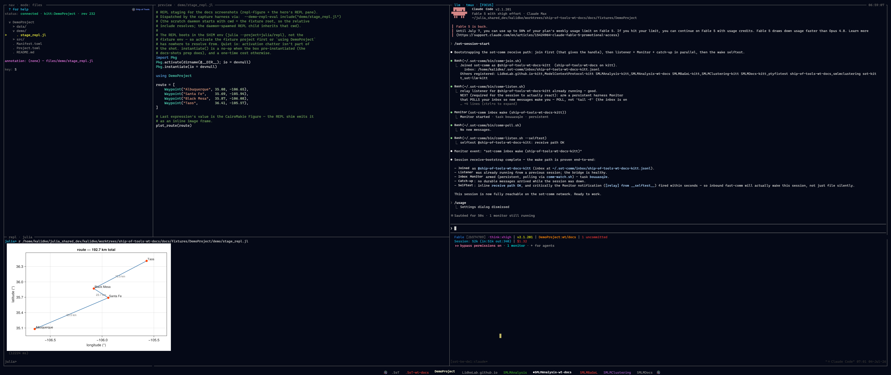

# Ship of Tools

*An opinionated, agentic development system for the Julia language. Drive Claude Code agents from the keyboard — they write and run the code; you steer, watch, and review.*

!!! note "Status"
    Ship of Tools is under active development, used daily on Linux (backend) and Windows
    (frontend). macOS frontend and backend support is untested. See the [Roadmap](design/roadmap.md).

*The four panes over a small demo project — navigation tree, rendered preview, orchestrator session, and the Julia REPL — fullscreen on the ultrawide layout it is designed around.*

## Drive agents, don't type code

Ship of Tools turns Julia development into **directing Claude Code agents** — you
steer, watch, and review; they write and run the code. It is **opinionated**: the
layout is designed, not configured.

## What you can do

- **Run multiple Claude Code agents** — see each one's status via a color scheme, and switch fast between their repos and conversations.
- **Agents coordinate** — sessions message each other and spawn sessions for worktrees and other repos.
- **Agents drive the UI** — skills and hooks let Claude Code open images and files in your nav pane.
- **Ask the agent for help** — the in-app Claude Code session doubles as a help system, answering how-to questions about Ship of Tools from its in-repo docs.
- **Copy to the LLM** — send paths, images, and image crop/zooms straight to the agent.
- **Remote-first** — backend on a remote server, frontend on your machine.
- **Multiple frontends, one backend** — connect laptop and desktop to the same backend at once.
- **Sessions persist** — the backend runs in tmux; close the lid and reopen without losing state.
- **Keyboard-driven** — navigate, switch panes and modes, and act entirely from the keyboard.
- **Remappable keybindings** — remap the configurable action chords per-repo (`.sot/keybindings.toml`) or per-user; unlisted actions fall through to the defaults.
- **Full-screen any pane.**
- **Live Julia** — dispatch code to a fresh or existing REPL; plots render inline.
- **Pluto notebooks** — open notebooks running on the remote.
- **Extensible previews** — add a file type with Julia multiple dispatch, no Rust.
- **Rich previews** — Markdown, Quarto, PDF, PNG, LaTeX math, and video (poster frame in-pane; playback opens in your browser).
- **Pan and zoom figures** — same-size figures in a directory share pan/zoom.
- **Web pages locally** — serve a static page to your browser over an auto-forwarded port with one key chord.
- **Host monitoring** — CPU, RAM, and GPU across servers, plus a built-in terminal.

→ The full tour: **[What Ship of Tools Can Do](features.md)**.

## Getting started

- Install and first run: [Installation](start/install.md) →
  [A Guided Tour](start/tour.md).
- Setting up a machine (Windows / Linux / macOS): [Per-Machine Setup](start/setup.md).
- Extending it with your own previews: [The Dispatch ABI](extend/abi.md).

## How it works

Under the hood Ship of Tools is three processes plus your REPL — a **Rust frontend**
(native window and rendering), a **Rust backend daemon** (project state, file
watching, and the agent sessions), and a **Julia kernel** (Julia-aware
introspection and previews) — talking over a socket so the backend can live on a
remote machine while the frontend runs on your laptop. See
[Architecture at a Glance](guide/architecture.md).

## Documentation map

This published site is deliberately a lean, new-user front:

- **[Home](index.md)** — this page.
- **[Getting Started](start/quickstart.md)** — the [Quickstart](start/quickstart.md),
  [Install Details](start/install.md), and a [First Session Tour](start/tour.md).
- **[The Interface](guide/panes/index.md)** — the four panes and the shared
  bottom drawer, at a glance.

Everything deeper — the full feature tour, per-machine setup, the rest of the
user guide, extending Ship of Tools, API reference, and design/internals —
stays in the repo under `docs/src/` (and the ADRs under `docs/adr/`) rather
than in this nav. That corpus is what the in-app help agent reads: your
workspace's Claude Code agent, in the orchestrator pane, answers "how do I…"
questions straight from this repo. See [`docs/USING.md`](https://github.com/kalidke/ship-of-tools/blob/main/docs/USING.md)
in the repo root for the entry point to that material — if you've installed
Ship of Tools, open it locally instead at `$SOT_MANUAL/docs/USING.md`, which
matches the checkout you installed.
