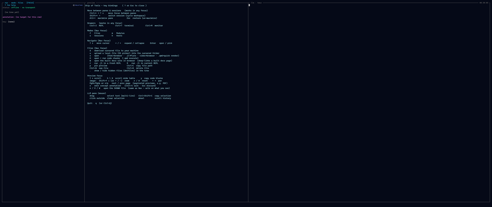

# Keybindings

The frontend reads its keybindings from a TOML file. Each action maps to one
chord, or to a list of chords. Any action you do not override falls through to the
built-in default, so a bindings file need only list what you want to change.

The repo's bindings live in `.sot/keybindings.toml`; this page documents the
discovery order, the chord grammar, and every action with its default chord(s).
For the other configuration files see [Configuration Files](config.md).


*The `?` overlay: every action with its current chord, including your overrides.*

## Discovery order

The first file found wins for the actions it lists; unlisted actions still fall
through to the built-in defaults:

1. `$SOT_KEYBINDINGS` — explicit path override.
2. `<repo-root>/.sot/keybindings.toml` — the project's bindings (the file in
   this repo).
3. `$HOME/.config/sot/keybindings.toml` — per-user bindings.
4. Built-in defaults compiled into the frontend.

Each action's chord(s) in an earlier file override the built-in default for that
action; an absent action falls through to the default.

## Chord grammar

A chord is zero or more `modifier+` tokens followed by exactly one key:

```text
[modifier+]... key
```

- **Modifiers** (case-insensitive): `ctrl`, `alt` (aliases `option`, `meta`),
  `shift`.
- **Key**: either a single character (`=`, `z`, `+`) or a `NamedKey`:
  `Tab`, `Enter`, `Escape`, `Space`, `Backspace`, `Delete`, `ArrowUp`,
  `ArrowDown`, `ArrowLeft`, `ArrowRight`, `PageUp`, `PageDown`, `Home`, `End`.

Multiple chords for one action are written as a TOML list:

```toml
font.scale_up = ["Ctrl+=", "Ctrl++"]
```

### The shift rule

Shift is enforced **only when the chord declares it**. On a US layout typing `+`
already carries shift, so `Alt+=` matches both `=` and `+` when alt is held;
writing `Alt+Shift+=` enforces the shift state explicitly. This is why the
zoom-in binding can list both `Ctrl+=` and `Ctrl++` to cover the shifted and
unshifted key.

## Actions and default chords

Grouped logically. Chords below are the defaults set in
`.sot/keybindings.toml`.

### Panes

| Action | Default chord | Scope / notes |
|--------|---------------|---------------|
| `pane.maximize` | `Alt+=` | Maximise the focused pane to fill the window. |
| `pane.restore` | `Escape` | Restore the full layout. `Esc` triggers this **only while a pane is maximized**; otherwise `Esc` passes through to the pty / edit mode / etc. |

### Sessions

| Action | Default chord | Scope / notes |
|--------|---------------|---------------|
| `session.create` | `Enter` | Sessions picker — commit the cursored directory as a new workspace, starting the comm-aware agent (`ccb`) in the pane. |
| `session.create_bare` | `Shift+Enter` | Commit the cursored directory as a new workspace with **no LLM agent** (plain shell/REPL). |

`session.create_bare` is matched **before** `session.create`, so a non-shift
`session.create` chord still fires when its shifted bare variant is held — keep
`create_bare` on a strictly-more-specific chord (here, the added `Shift`).

### Modes

| Action | Default chord | Scope / notes |
|--------|---------------|---------------|
| `mode.files` | `f` | Switch the nav root to Files mode. |
| `mode.modules` | `m` | Switch to Modules mode. |
| `mode.sessions` | `s` | Switch to Sessions mode. |
| `mode.hosts` | `h` | Switch to Hosts mode. |

Mode switches are active **only in nav focus** — single-character chords stay
literal text in the pty, editor, and prompts.

### Drawers

| Action | Default chord | Scope / notes |
|--------|---------------|---------------|
| `drawer.repl` | `Ctrl+j` | Toggle the Julia REPL drawer (global). |
| `drawer.terminal` | `Ctrl+t` | Toggle the Terminal drawer (global). |
| `drawer.monitor` | `Ctrl+m` | Toggle the server Monitor drawer (global). |

Drawer toggles are global — they fire even when another pane has focus.

### Focus

| Action | Default chord | Scope / notes |
|--------|---------------|---------------|
| `focus.pane_left` | `Ctrl+ArrowLeft` | Move focus to the pane on the left (global, 4-way). |
| `focus.pane_right` | `Ctrl+ArrowRight` | Move focus right. |
| `focus.pane_up` | `Ctrl+ArrowUp` | Move focus up. |
| `focus.pane_down` | `Ctrl+ArrowDown` | Move focus down. |

Spatial focus is kept disjoint from plain arrows (per-pane navigation) and
`Shift+Arrow` (workspace cycle).

### Workspace

| Action | Default chord | Scope / notes |
|--------|---------------|---------------|
| `workspace.cycle_next` | `Shift+ArrowRight` | Cycle to the next workspace (global; ignored while editing a file). |
| `workspace.cycle_prev` | `Shift+ArrowLeft` | Cycle to the previous workspace. |

### Chrome

| Action | Default chord | Scope / notes |
|--------|---------------|---------------|
| `quit` | `Ctrl+q` | Quit. **Nav focus only** — won't fire in the pty panes. |
| `help.toggle` | `?` | Toggle the help overlay. Nav / preview focus, outside edit mode. |
| `view.fullscreen` | `F11` | Toggle window fullscreen. |
| `transport.reconnect` | `F5` | Reconnect the backend transport. |

### Font

| Action | Default chord | Scope / notes |
|--------|---------------|---------------|
| `font.scale_up` | `Ctrl+=`, `Ctrl++` | Zoom in. `=` and shifted `+` both zoom in. |
| `font.scale_down` | `Ctrl+-`, `Ctrl+_` | Zoom out. `-` and `_` both zoom out. |
| `font.scale_reset` | `Ctrl+0` | Reset font scale. |

### In-pane context (fixed)

These single-key actions feed context to the in-pane agent. They are **not yet
rebindable** — they are not part of the configurable action set above.

| Key | Scope | What it does |
|-----|-------|--------------|
| `c` | file nav focus | Copy the cursored file's path (absolute, backend-side) to the OS clipboard — paste it into the agent's prompt. |
| `c` | preview focus | Crop the visible region of a zoomed image preview and send it to the in-pane agent. |

## See also

- [Configuration Files](config.md) — `settings.toml` and `hosts.toml`.
